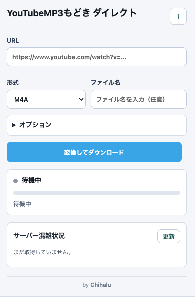

# YouTubeMP3もどき ダイレクト

## インストール

1. Chrome で `chrome://extensions/` を開く。
2. 右上の「デベロッパー モード」を有効にする。
3. 「パッケージ化されていない拡張機能を読み込む」を押す。
4. このフォルダを選択する。

## 使い方

1. 変換したい動画ページを開いた状態で拡張機能アイコンを押す。
2. URL、形式、必要ならファイル名やオプションを設定する。
   - 本家サイトでシリアルコードを保存済みの場合は、「認証チェック」で読み込めます。
3. 「変換してダウンロード」を押す。

完了すると `/file/{download_task_id}` のURLを Chrome のダウンロード API に渡します。ファイル名を空欄にした場合は、サーバー側の `Content-Disposition` に任せます。

## 実装メモ

- サーバー状態は `https://ytmm-api-s*.shamimomo.net/v1/health` を見て、通常サーバーのうち待機数が少ないものを選択します。
- サーバー状態の確認結果は30秒間キャッシュし、負荷軽減のため、短時間の連続変換で `/health` を毎回叩かないようにしています。
- ポップアップの「サーバー混雑状況」から各サーバーの待機数・実行数を確認できます。
- 選択サーバーまたは待機情報が150人以上の場合のみ、完了・失敗後に5秒の再実行クールダウンを入れます。
- シリアルコードを入力した場合はプレミアムサーバーを優先します。
- 「認証チェック」は `https://receive.shamimomo.net/YouTubeMP3modoki/` の `localStorage` に保存されたシリアルコードを拡張機能側へ読み込みます。
- 変換開始・変換完了・ダウンロード開始・ダウンロード完了は Chrome 通知で知らせます。
- 変換中の Server-Sent Events は `offscreen.html` / `offscreen.js` で読み、ポップアップを閉じても変換処理が途切れにくい構成にしています。
- サーバー再起動予定時刻の 04:00 / 10:00 / 16:00 / 22:00 (JST) の30分前から、その時刻までは新規変換を開始できません。
- 変換は `POST /download` の Server-Sent Events を読み、`result` イベント後に `GET /file/{download_task_id}` をダウンロードします。
- 長時間の変換中は Chrome の拡張 service worker の都合で中断される可能性があります。その場合は再実行してください。

## 自身でサーバーを立てられる場合
こちらをご利用してみて下さい。https://github.com/ChihaluCoding/yt-dl
